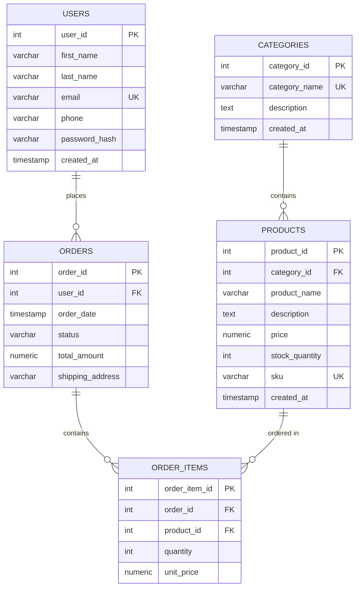

# RevoShop ERD — Checkpoint 1

```mermaid
erDiagram
    USERS ||--o{ ORDERS : places
    CATEGORIES ||--o{ PRODUCTS : contains
    ORDERS ||--o{ ORDER_ITEMS : contains
    PRODUCTS ||--o{ ORDER_ITEMS : "ordered in"

    USERS {
        int user_id PK
        varchar first_name
        varchar last_name
        varchar email UK
        varchar phone
        varchar password_hash
        timestamp created_at
    }

    CATEGORIES {
        int category_id PK
        varchar category_name UK
        text description
        timestamp created_at
    }

    PRODUCTS {
        int product_id PK
        int category_id FK
        varchar product_name
        text description
        numeric price
        int stock_quantity
        varchar sku UK
        timestamp created_at
    }

    ORDERS {
        int order_id PK
        int user_id FK
        timestamp order_date
        varchar status
        numeric total_amount
        varchar shipping_address
    }

    ORDER_ITEMS {
        int order_item_id PK
        int order_id FK
        int product_id FK
        int quantity
        numeric unit_price
    }
```
