[](https://classroom.github.com/a/wGq_UtnU)

# RevoShop — Flask + PostgreSQL Backend

## Overview

RevoShop adalah backend API untuk toko online sederhana, dibangun dengan
Flask, SQLAlchemy, dan PostgreSQL. Proyek ini mencakup tiga checkpoint:

1. **Checkpoint 1** — desain skema database (`users`, `categories`,
   `products`, `orders`, `order_items`).
2. **Checkpoint 2** — mapping skema ke model SQLAlchemy dan migrasi
   Flask-Migrate.
3. **Checkpoint 3** — API CRUD lengkap untuk semua modul, validasi,
   error handling, testing (pytest + Locust), dan deployment.

API ini mengelola user, kategori produk, produk, dan order — termasuk
relasi many-to-many antara order dan produk lewat tabel `order_items`
yang menyimpan snapshot harga saat pembelian.

## Features Implemented

- **Full CRUD** untuk Products, Categories, dan Orders (GET all, GET by
  id, POST, PUT, DELETE).
- **User & Auth** — registrasi user (`POST /users`) dan login
  (`POST /auth/login`) tanpa session/token (sesuai catatan Module 2 —
  client mengirim `user_id` di body/params untuk endpoint yang butuh
  identitas pengguna).
- **Relasi many-to-many** antara `orders` dan `products` melalui tabel
  asosiasi `order_items`, lengkap dengan `quantity` dan `unit_price`
  sebagai snapshot harga saat order dibuat (harga produk yang berubah
  di kemudian hari tidak memengaruhi total order lama).
- **Data validation** — field wajib, tipe data (harga/stok harus angka
  non-negatif), keberadaan foreign key (`category_id` pada produk,
  `product_id`/`user_id` pada order), dan keunikan (`sku`, `email`,
  `category_name`, `slug`).
- **Error handling** dengan try/except di setiap operasi tulis
  (POST/PUT/DELETE), dengan rollback transaksi dan pesan error yang jelas.
- **Deletion guard** — `DELETE /products/<id>` ditolak (409) jika produk
  masih terhubung ke order yang statusnya aktif (`waiting`, `paid`,
  `shipped`); `DELETE /categories/<id>` ditolak jika kategori masih
  memiliki produk.
- **Soft delete** — `DELETE /products/<id>` dan `DELETE /users/<id>`
  tidak menghapus baris secara fisik, hanya menandai `deleted_at`. Ini
  menjaga riwayat order/order_items tetap valid meski produk atau
  akun penggunanya "dihapus" dari sisi pengguna.
  `GET /products` secara default menyembunyikan produk yang sudah
  soft-deleted (bisa dimunculkan lagi dengan `?include_deleted=true`).
- **SEO-friendly product slug** — slug dibuat otomatis dari
  `product_name` (atau dari field `slug` custom bila dikirim), dengan
  deduplikasi otomatis (`wireless-mouse`, `wireless-mouse-2`, dst.) bila
  ada nama yang sama.
- **Product images** — field `images` (list URL) di setiap produk,
  divalidasi (maks. 10 URL, tidak boleh string kosong).
- **Query parameters** untuk filtering, sorting, dan pagination:
  - `GET /products?category_id=&min_price=&max_price=&search=&sort=&page=&per_page=`
  - `GET /orders?user_id=&status=&min_total=&max_total=&sort=&page=&per_page=`
  - `sort` menerima nama kolom, dengan prefix `-` untuk descending
    (misal `sort=-price`).
- **Business logic order** yang divalidasi penuh di backend (tidak
  pernah dipercaya dari body request):
  - `POST /orders` mengecek `stock_quantity >= qty` untuk setiap item,
    mengambil `unit_price` dari tabel `products` (bukan dari body), dan
    menghitung `total_amount` di backend. Stok langsung berkurang saat
    order dibuat.
  - Transisi status order divalidasi lewat state machine:
    `waiting → paid → shipped → delivered`, dengan `waiting`/`paid` juga
    bisa bertransisi ke `cancelled`. Transisi yang tidak valid (misalnya
    `waiting → shipped` langsung) ditolak dengan 409.
  - `POST /orders/<id>/pay` — simulasi callback payment gateway:
    `waiting → paid`.
  - Membatalkan order (`PUT` status `cancelled`) dari `waiting`/`paid`
    mengembalikan (`restock`) seluruh stok yang sudah direservasi.
  - `PUT /orders/<id>` hanya mengizinkan perubahan pada `status`,
    `shipping_address`, dan `items` — field lain ditolak (400). Item
    (produk/qty) hanya bisa diubah selagi order masih `waiting`.
  - `DELETE /orders/<id>` hanya diperbolehkan untuk order `waiting`
    (dengan restock otomatis) atau yang sudah `cancelled`; order yang
    `paid`/`shipped`/`delivered` tidak dapat dihapus (bagian dari
    riwayat transaksi).
- **Automated tests** (pytest, 79 test) — cakupan penuh untuk Category,
  Product, Order, dan User (happy path + error case di setiap endpoint),
  termasuk seluruh state transition order, restock, soft-delete, dan
  query parameter filtering/sorting/pagination.
- **Load testing** (Locust) — skenario sequential: GET semua produk →
  GET satu produk → POST order baru → GET order yang baru dibuat.

## API Endpoints

| Method | Endpoint | Deskripsi |
|---|---|---|
| POST | `/users` | Registrasi user baru |
| GET | `/users/<id>` | Ambil satu user |
| PUT | `/users/<id>` | Update profil user (username/phone/address) |
| DELETE | `/users/<id>` | Soft-delete akun user |
| POST | `/auth/login` | Login (email + password) |
| GET | `/products` | List produk (filter/sort/pagination, lihat di atas) |
| GET | `/products/<id>` | Ambil satu produk |
| POST | `/products` | Buat produk baru (slug otomatis, images opsional) |
| PUT | `/products/<id>` | Update produk |
| DELETE | `/products/<id>` | Soft-delete produk (ditolak jika ada order aktif) |
| GET | `/categories` | List semua kategori |
| GET | `/categories/<id>` | Ambil satu kategori + daftar produknya |
| POST | `/categories` | Buat kategori baru |
| PUT | `/categories/<id>` | Update kategori |
| DELETE | `/categories/<id>` | Hapus kategori (ditolak jika masih ada produk) |
| GET | `/orders` | List order (filter/sort/pagination, lihat di atas) |
| GET | `/orders/<id>` | Ambil satu order + item + detail produk |
| POST | `/orders` | Buat order baru (`user_id`, `shipping_address`, `items`) |
| PUT | `/orders/<id>` | Update status/alamat/item order (lihat business logic di atas) |
| POST | `/orders/<id>/pay` | Simulasi pembayaran: `waiting` → `paid` |
| DELETE | `/orders/<id>` | Hapus order (hanya `waiting`/`cancelled`) |

## Technologies Used

- **Flask** — web framework
- **Flask-SQLAlchemy** — ORM
- **Flask-Migrate** (Alembic) — migrasi skema database
- **PostgreSQL** — database relasional
- **pgAdmin / DBeaver** — GUI administrasi database
- **pytest** — automated testing
- **Locust** — load/performance testing
- **python-dotenv** — memuat konfigurasi dari `.env`
- **gunicorn** — WSGI server untuk production
- Platform deployment:Railway 

## How to Run the Project Locally

1. Clone repo dan masuk ke foldernya:
   ```powershell
   git clone https://github.com/<username>/<nama-repo>.git
   cd <nama-repo>
   ```

2. Buat dan aktifkan virtual environment:
   ```powershell
   python -m venv .venv
   .\.venv\Scripts\Activate.ps1
   ```

3. Install dependency:
   ```powershell
   pip install -r requirements.txt
   ```

4. Siapkan file `.env` dari template:
   ```powershell
   Copy-Item .env.example .env
   ```
   Lalu sesuaikan `DATABASE_URL` dan `SECRET_KEY` di `.env` dengan
   kredensial PostgreSQL lokal kamu.

5. Buat database dan jalankan migrasi:
   ```powershell
   psql -U postgres -h localhost -c "CREATE DATABASE revoshop_db;"
   $env:FLASK_APP = 'run.py'
   flask db upgrade
   ```

6. Jalankan aplikasi:
   ```powershell
   python run.py
   ```
   Server berjalan di `http://127.0.0.1:5000`.

### Menjalankan tests

```powershell
pytest tests/ -v
```

### Menjalankan load test (Locust)

```powershell
locust -f locustfile.py --host http://127.0.0.1:5000
```
Buka `http://localhost:8089` di browser, atau jalankan headless dengan
ramp-up 50 → 200 user:
```powershell
locust -f locustfile.py --host http://127.0.0.1:5000 --users 200 --spawn-rate 10 --run-time 5m --headless
```

## Deployment

- **API**: dideploy sebagai proses `web: gunicorn run:app` (lihat
  `Procfile`). Set environment variable `DATABASE_URL` dan `SECRET_KEY`
  di platform deployment — jangan commit `.env`.
- **Database**: PostgreSQL hosted (Render/Railway/Supabase/Neon, dll).
  Setelah database live, jalankan `flask db upgrade` terhadap
  `DATABASE_URL` production untuk menerapkan seluruh migrasi.
- URL production: [[_link_deploy_](https://2assigmentcheckpoint1-production.up.railway.app/products)]


## Screenshots

### Postman — Flow User & Auth (registrasi sampai soft-delete)

| # | Langkah | Screenshot |
|---|---|---|
| 1 | Register user baru | 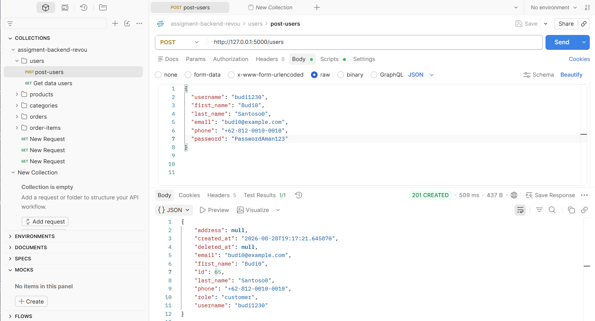 |
| 2 | Login untuk dapat JWT token | 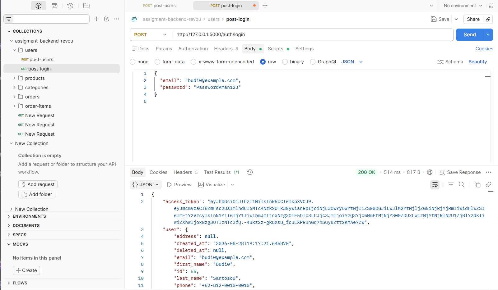 |
| 3 | Get user | 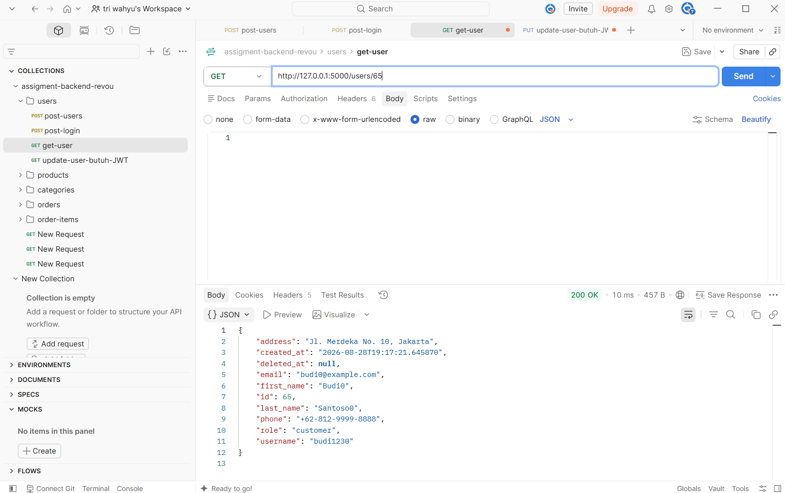 |
| 4 | Update user (butuh JWT) | 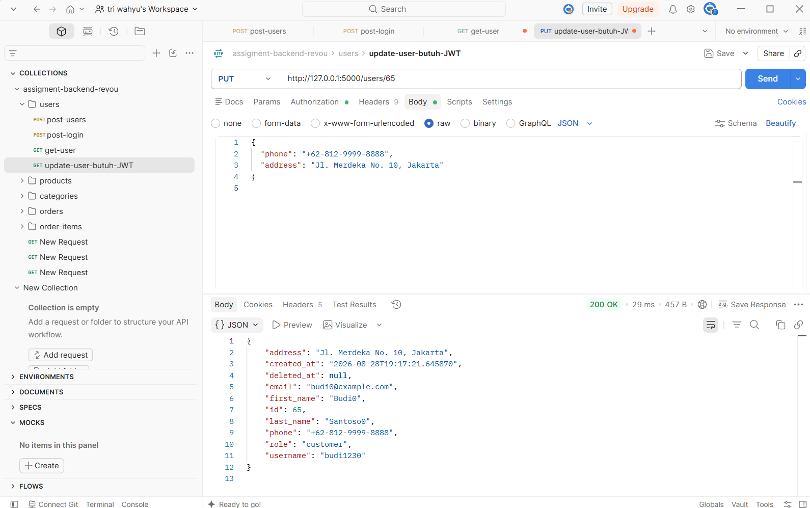 |
| 5 | Delete user (soft-delete, butuh JWT) | 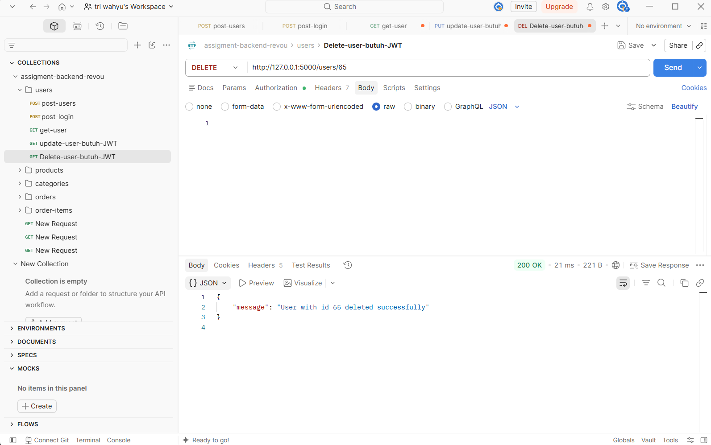 |
| 6 | Verifikasi akun sudah dinonaktifkan | 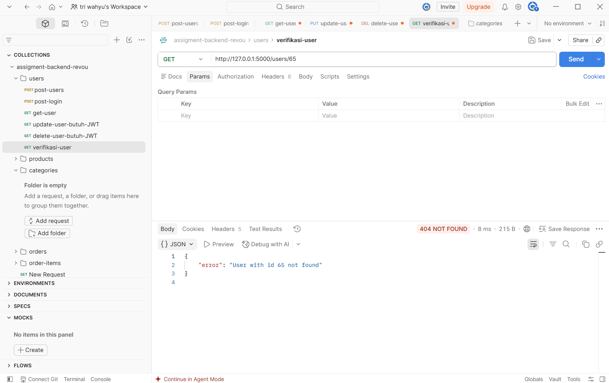 |

### DBeaver — Tabel di Database Production

| Tabel | Screenshot |
|---|---|
| `alembic_version` (riwayat migrasi) | 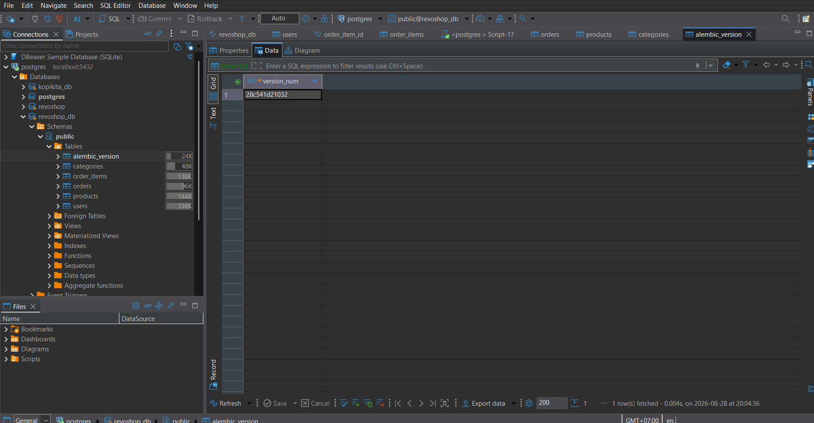 |
| `users` | 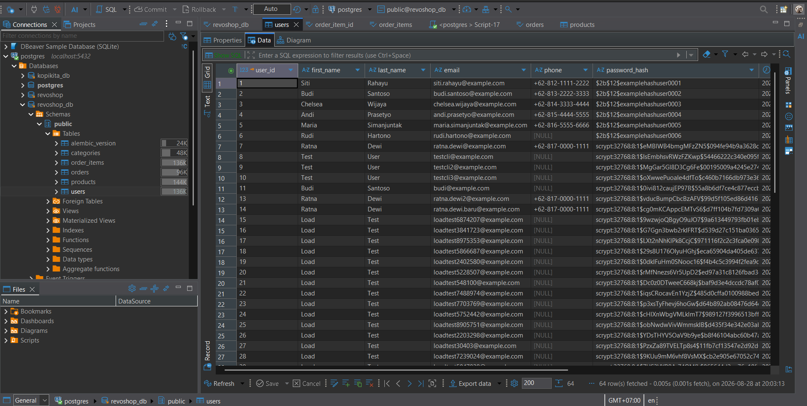 |
| `categories` | 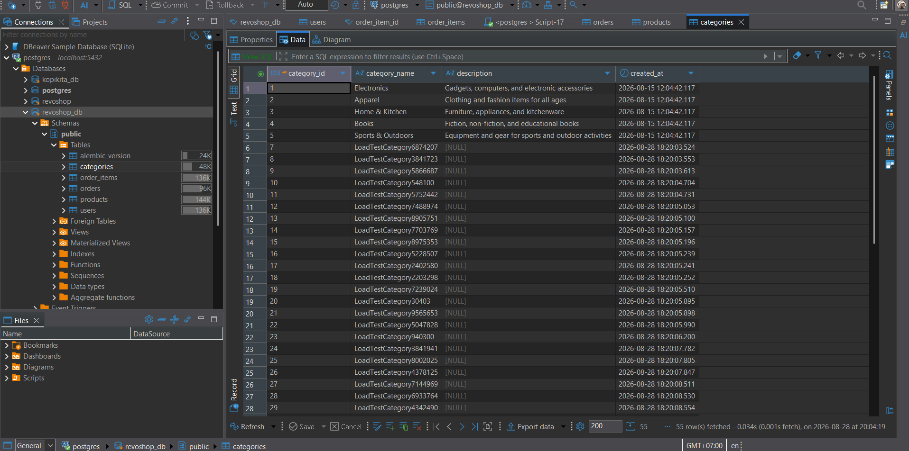 |
| `products` | 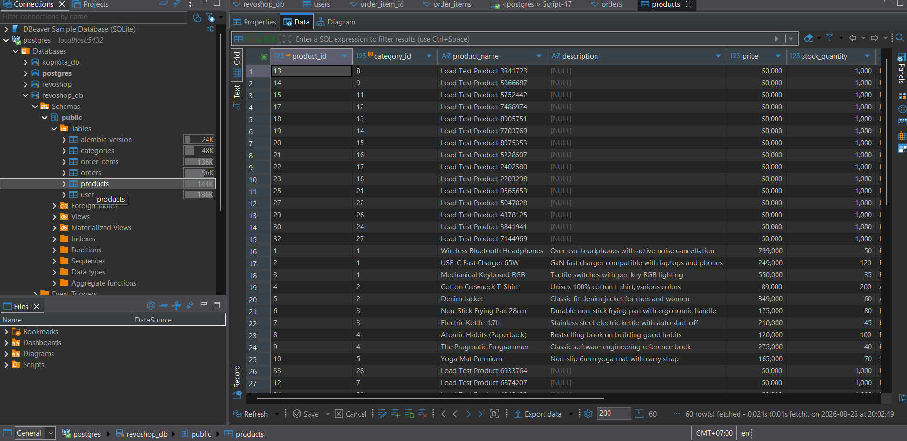 |
| `orders` | 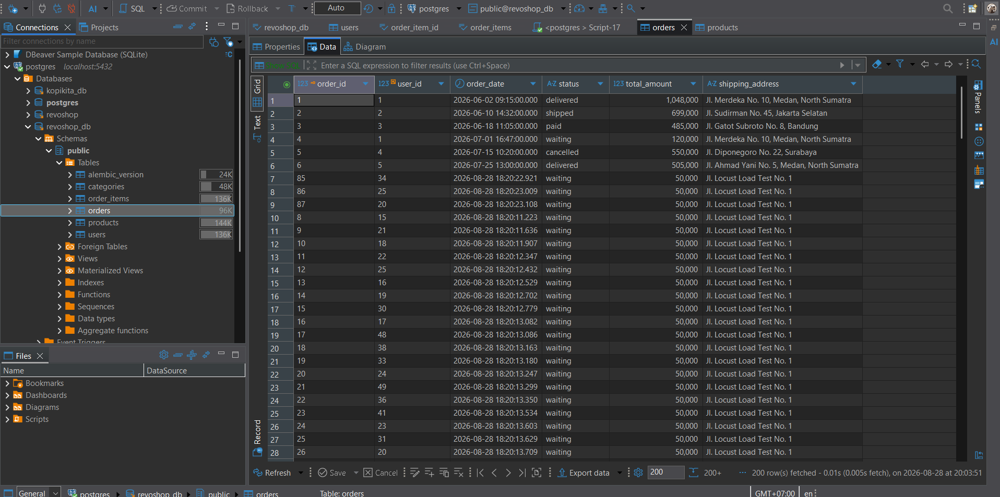 |
| `order_items` | 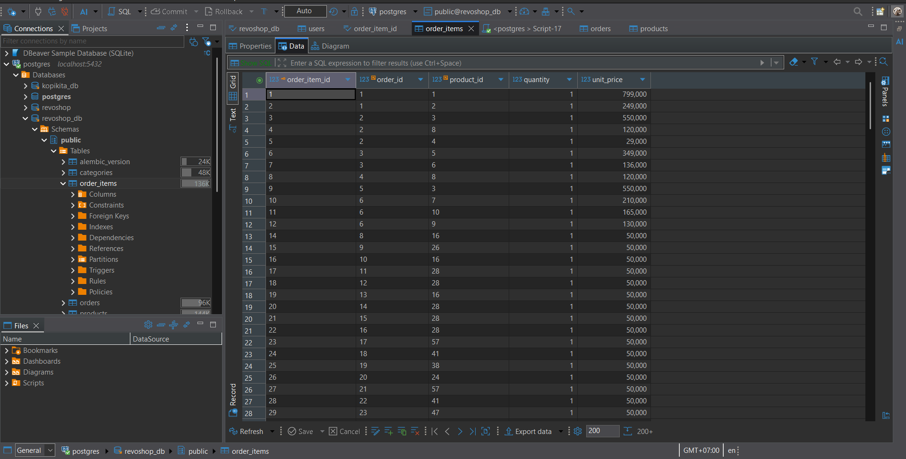 |

### Locust — Load Test Dashboard

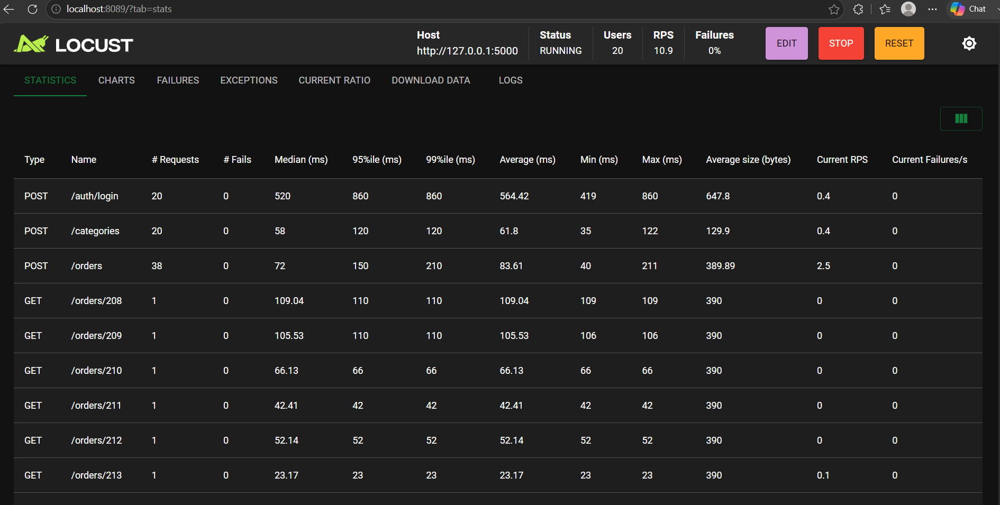

### Pytest 
- ada di file report.html

## Project Structure

```
config.py                  -> konfigurasi Flask (Config, TestConfig)
run.py                      -> entry point aplikasi
requirements.txt            -> daftar dependency
Procfile                    -> perintah start untuk deployment (gunicorn)
locustfile.py                -> skenario load test
.env.example                -> template variabel environment
.env                        -> variabel environment asli (gitignored)
app/
  __init__.py               -> app factory (create_app), init db & migrate
  utils.py                   -> slugify, pagination & sort query-param helpers
  models/                    -> User, Category, Product, Order, order_items
  routes/                    -> user_routes, product_routes, category_routes, order_routes
migrations/                  -> riwayat migrasi Flask-Migrate
tests/                       -> pytest suite (category, product, order, user)
1_checkpoint_revoshop_sql/    -> schema.sql & seed.sql dari Checkpoint 1
2_Schema_diagram/             -> ERD
```
